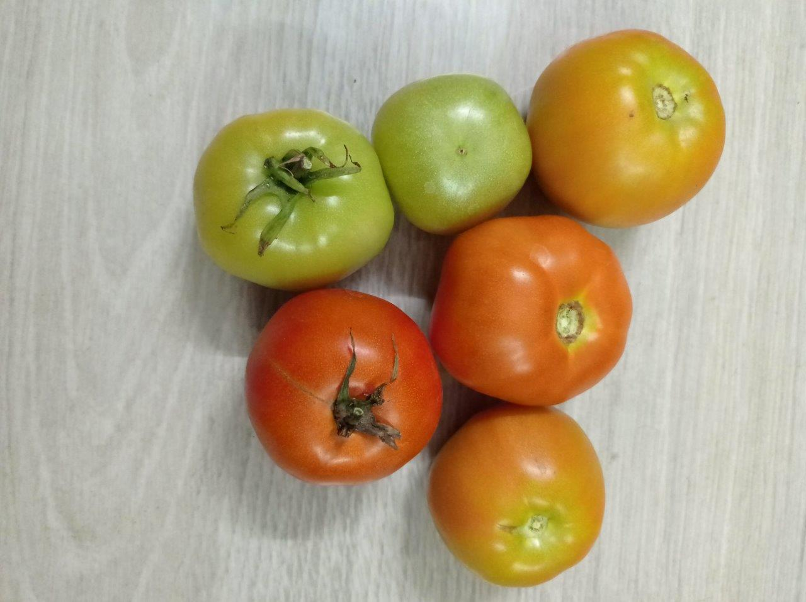
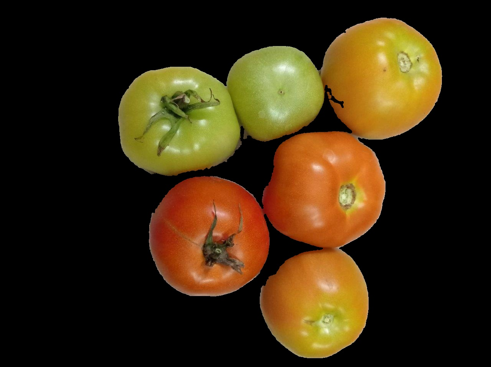
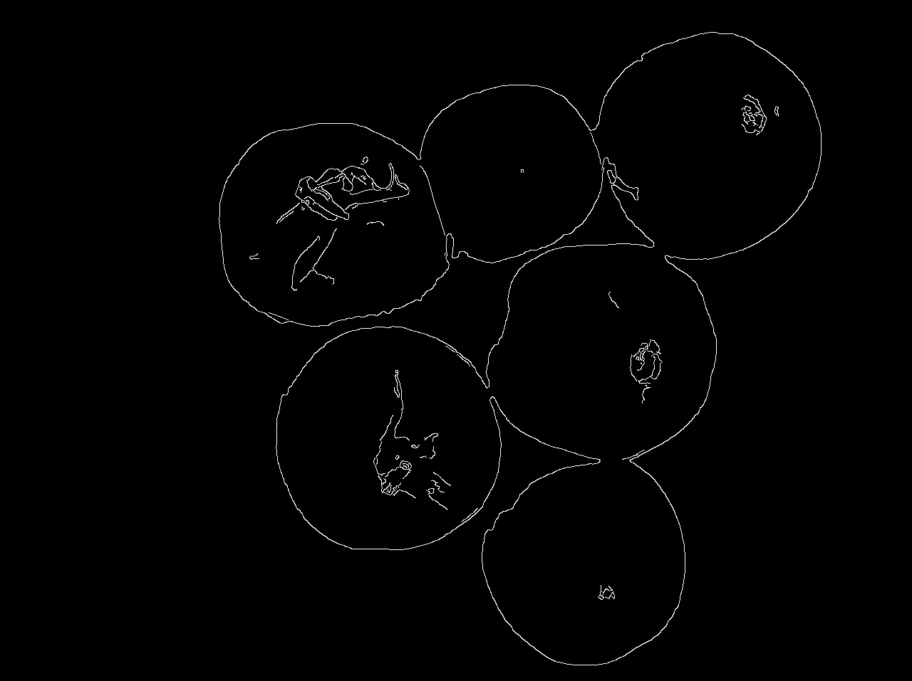
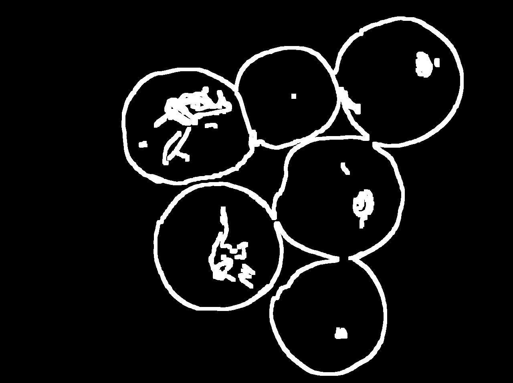
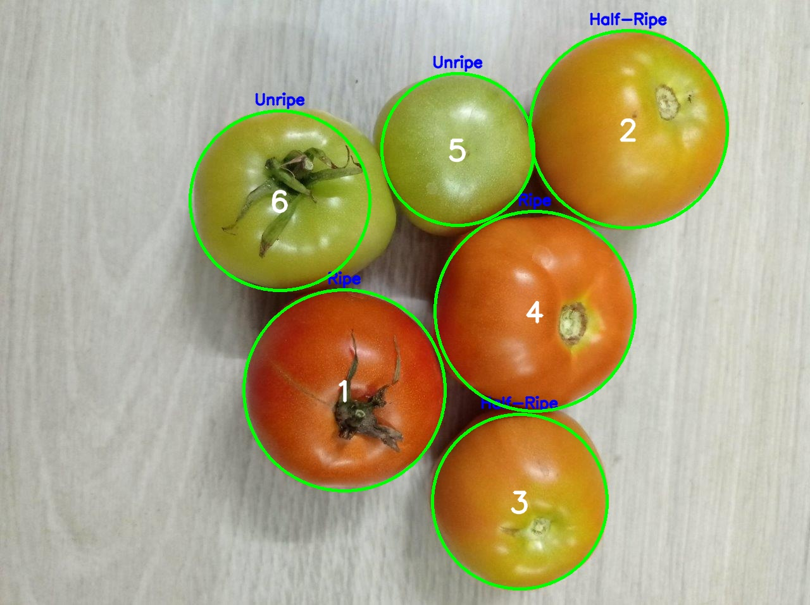

# 🍅 Tomato Maturity Detection & Quality Grading 🚀

A computer vision project that detects tomatoes in images, segments them, and classifies their maturity stage (Ripe, Half-Ripe, Unripe) based on HSV color features.  
The system uses classical image processing techniques including color thresholding, morphological operations, and Hough Circle detection for tomato localization.

## ✨ Key Features
- **Color-Based Classification:** Uses HSV color thresholds to classify tomatoes into maturity stages.
- **Morphological Processing:** Cleans and refines masks with closing/opening operations.
- **Circle Detection:** Detects tomato boundaries using HoughCircles.
- **Automatic Labeling:** Annotates each tomato with its ID and maturity status.
- **Visualization:** Generates and saves multiple intermediate processing steps and final results.
- **Notebook Implementation:** Entire workflow is implemented in a Jupyter Notebook (`Untitled.ipynb`).

---

## 📊 Sample Output

Below are some sample outputs generated by the system (saved in `output/`):

#### 1. Original Image


#### 2. Masked RGB Image


#### 3. Edge Detection


#### 4. Dilated Edges


#### 5. Final Detection with Labels


---

## 🛠 Installation & Setup

### Prerequisites
- Python 3.8+
- Jupyter Notebook

### Required Libraries
Create a file named `requirements.txt` with the following content:

```txt
opencv-python
numpy
matplotlib
```
# ▶️ Running the Project
Run the Jupyter Notebook:
```txt
jupyter notebook Untitled.ipynb
```

# 📂 Project Structure
```txt
.
├── Untitled.ipynb         # Main notebook (detection + classification pipeline)
├── requirements.txt       # List of dependencies
├── output/                # Sample output images
└── README.md              # Project documentation
```

# 🔗 References

Dataset: Tomato Maturity Detection and Quality Grading

OpenCV: https://docs.opencv.org/

Matplotlib: https://matplotlib.org/

# 🤝 Contributing

Contributions are welcome! To contribute:

Fork the repository.

Create a new branch: git checkout -b feature/YourFeature.

Commit changes: git commit -m 'Add new feature'.

Push to branch: git push origin feature/YourFeature.

Open a Pull Request.

# 📜 License

This project is licensed under the Apache License.
